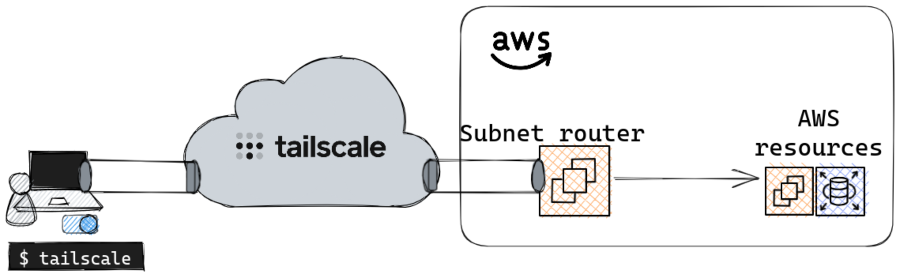

# Tailscale subnet router

This module allows to provision EC2 instances (part of an Autoscaling group) in order to access to private AWS resources using [Tailscale](https://tailscale.com/)



## ✔️ Prerequisites

In order for your instances to join automatically your `tailnet` at startup, you need to:

* [Generate an auth key](https://tailscale.com/kb/1085/auth-keys/?q=auth%20key) or use the Tailscale provider ([here](/examples/with_provider/) is an example)
* Add an [autoApprovers](https://tailscale.com/kb/1018/acls/#auto-approvers-for-routes-and-exit-nodes) ACL so that the routes will be advertised
* Set the variable `auth_key`

## :rocket: Deploy

Set the appropriate variables in `variables.tfvars` and run the following command:
```console
tofu plan --var-file variables.tfvars
```

After checking the plan, apply it:
```console
tofu apply --var-file variables.tfvars
```

## 🔍 CI

Run the following command in order to check the code before pushing a PR.

```console
task pre-commit
```

<!-- BEGINNING OF PRE-COMMIT-TERRAFORM DOCS HOOK -->
## Requirements

| Name | Version |
|------|---------|
| <a name="requirement_terraform"></a> [terraform](#requirement\_terraform) | ~> 1.4 |
| <a name="requirement_aws"></a> [aws](#requirement\_aws) | ~> 5.0 |
| <a name="requirement_cloudinit"></a> [cloudinit](#requirement\_cloudinit) | ~> 2.3 |
| <a name="requirement_random"></a> [random](#requirement\_random) | ~> 3.2 |

## Providers

| Name | Version |
|------|---------|
| <a name="provider_aws"></a> [aws](#provider\_aws) | 5.20.0 |
| <a name="provider_cloudinit"></a> [cloudinit](#provider\_cloudinit) | 2.3.2 |
| <a name="provider_random"></a> [random](#provider\_random) | 3.5.1 |

## Modules

No modules.

## Resources

| Name | Type |
|------|------|
| [aws_autoscaling_group.this](https://registry.terraform.io/providers/hashicorp/aws/latest/docs/resources/autoscaling_group) | resource |
| [aws_iam_instance_profile.tailscale_profile](https://registry.terraform.io/providers/hashicorp/aws/latest/docs/resources/iam_instance_profile) | resource |
| [aws_iam_role.tailscale_role](https://registry.terraform.io/providers/hashicorp/aws/latest/docs/resources/iam_role) | resource |
| [aws_iam_role_policy_attachment.ssm_worker_nodes](https://registry.terraform.io/providers/hashicorp/aws/latest/docs/resources/iam_role_policy_attachment) | resource |
| [aws_launch_template.this](https://registry.terraform.io/providers/hashicorp/aws/latest/docs/resources/launch_template) | resource |
| [aws_security_group.this](https://registry.terraform.io/providers/hashicorp/aws/latest/docs/resources/security_group) | resource |
| [aws_security_group_rule.default_egress](https://registry.terraform.io/providers/hashicorp/aws/latest/docs/resources/security_group_rule) | resource |
| [random_pet.prefix](https://registry.terraform.io/providers/hashicorp/random/latest/docs/resources/pet) | resource |
| [aws_ami.ubuntu](https://registry.terraform.io/providers/hashicorp/aws/latest/docs/data-sources/ami) | data source |
| [cloudinit_config.tailscale_cloud_init](https://registry.terraform.io/providers/hashicorp/cloudinit/latest/docs/data-sources/config) | data source |

## Inputs

| Name | Description | Type | Default | Required |
|------|-------------|------|---------|:--------:|
| <a name="input_advertise_routes"></a> [advertise\_routes](#input\_advertise\_routes) | List of CIDR blocks that are routed through Tailscale | `list(string)` | n/a | yes |
| <a name="input_auth_key"></a> [auth\_key](#input\_auth\_key) | Tailscale auth key used to join the tailnet | `string` | `""` | no |
| <a name="input_autoscaling"></a> [autoscaling](#input\_autoscaling) | Autoscaling configuration | <pre>object({<br>    min = number<br>    max = number<br>  })</pre> | <pre>{<br>  "max": 2,<br>  "min": 1<br>}</pre> | no |
| <a name="input_env"></a> [env](#input\_env) | Environment of the Tailscale instances | `string` | `""` | no |
| <a name="input_extra_args"></a> [extra\_args](#input\_extra\_args) | Additionnal arguments to append to the tailscale commmand line | `string` | `""` | no |
| <a name="input_instance_type"></a> [instance\_type](#input\_instance\_type) | EC2 instance type | `string` | `"t3a.micro"` | no |
| <a name="input_name"></a> [name](#input\_name) | Prefix for the autoscaling group | `string` | `null` | no |
| <a name="input_prometheus_node_exporter_enabled"></a> [prometheus\_node\_exporter\_enabled](#input\_prometheus\_node\_exporter\_enabled) | If set to true install and start a prometheus node exporter | `bool` | `false` | no |
| <a name="input_region"></a> [region](#input\_region) | Name of the AWS Region | `string` | n/a | yes |
| <a name="input_resources_to_tag"></a> [resources\_to\_tag](#input\_resources\_to\_tag) | list of resources we want to tag on aws\_launch\_template | `list(string)` | <pre>[<br>  "instance",<br>  "volume"<br>]</pre> | no |
| <a name="input_ssm_enabled"></a> [ssm\_enabled](#input\_ssm\_enabled) | If set to true install and start the AWS SSM agent | `bool` | `false` | no |
| <a name="input_subnet_ids"></a> [subnet\_ids](#input\_subnet\_ids) | Private subnet IDs where the Tailscale instances will be created | `list(string)` | n/a | yes |
| <a name="input_tags"></a> [tags](#input\_tags) | Default tags for all the resources | `map(string)` | `{}` | no |
| <a name="input_tailscale_ssh_enabled"></a> [tailscale\_ssh\_enabled](#input\_tailscale\_ssh\_enabled) | If true Tailscale will be started with SSH support | `bool` | `false` | no |
| <a name="input_vpc_id"></a> [vpc\_id](#input\_vpc\_id) | ID of the VPC where the Tailscale instances will be created | `string` | n/a | yes |

## Outputs

| Name | Description |
|------|-------------|
| <a name="output_autoscaling_group_id"></a> [autoscaling\_group\_id](#output\_autoscaling\_group\_id) | value |
| <a name="output_security_group_id"></a> [security\_group\_id](#output\_security\_group\_id) | value |
<!-- END OF PRE-COMMIT-TERRAFORM DOCS HOOK -->